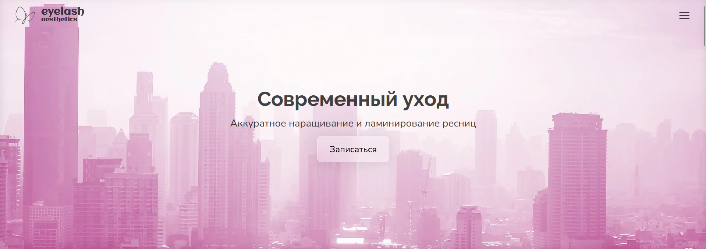
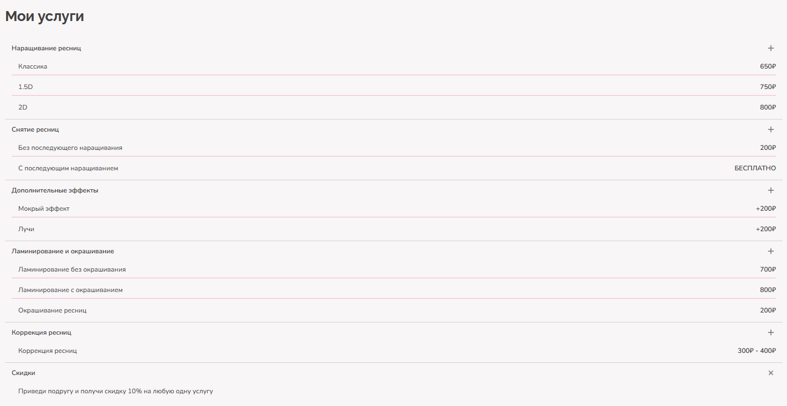

# Eyelash Aesthetics 💖

**Eyelash Aesthetics** — современное веб-приложение для салонов красоты, которое позволяет управлять услугами ресниц, демонстрировать их клиентам и обеспечивать удобный интерфейс для администраторов и посетителей.

---

## 🎯 Цель проекта

- Предоставить веб-салону простой способ показать свои услуги по наращиванию и уходу за ресницами  
- Облегчить управление услугами и их описаниями  
- Обеспечить современный, отзывчивый интерфейс для пользователей  

---

## 🖼 Демо / Скриншоты

> *(замени ссылками на реальные скриншоты или GIF)*

  
  

---

## ⚡ Основные возможности

- Просмотр списка услуг с детальным описанием  
- Фильтры и поиск услуг  
- CRUD для администраторов (создание, редактирование, удаление услуг)  
- Простое хранилище данных в `db.json`  
- Адаптивный интерфейс под мобильные устройства  

---

## 🛠 Технологии

- **TypeScript** — надёжная типизация и контроль кода  
- **React** — современный фронтенд  
- **JSON** — хранилище данных (`db.json`)  
- **Node.js + Express** — (если есть backend)  
- **CSS / HTML** — стилизация и структура  

---

## 🚀 Установка и запуск

1. Клонируем репозиторий:

```bash
git clone https://github.com/aklyue/eyelash-aesthetics.git
cd eyelash-aesthetics```

2. Устанавливаем зависимости:

```bash
npm install```

3. Запускаем проект:

```bash
npm start```

4. Открываем в браузере: http://localhost:3000

---

## 💾 Работа с данными

 - Все услуги хранятся в файле db.json
 - Для добавления новых услуг можно использовать интерфейс приложения или редактировать JSON вручную:

```json
{
  "id": "uuid",
  "name": "Наращивание ресниц",
  "description": "Элегантное и натуральное наращивание",
  "price": 3000
}```

---

## 🗺 Планы на будущее

 - Интеграция с полноценной базой данных (PostgreSQL / MongoDB)
 - Авторизация пользователей и администраторов
 - Панель администратора с полным управлением услугами
 - Интеграция оплаты и бронирования
 - Улучшение UX и анимаций интерфейса

---

## 📜 Лицензия

Этот проект распространяется под лицензией **MIT**. См. файл [LICENSE](LICENSE) для подробностей.

---

<div align="center">

**Веб-приложение является проектом заказчика**

[🔗 GitHub](https://github.com/aklyue/eyelash-aesthetics) • [📧 Email](mailto:olegglapshin@gmail.com) • [🐛 Issues](https://github.com/aklyue/eyelash-aesthetics/issues)

</div>

